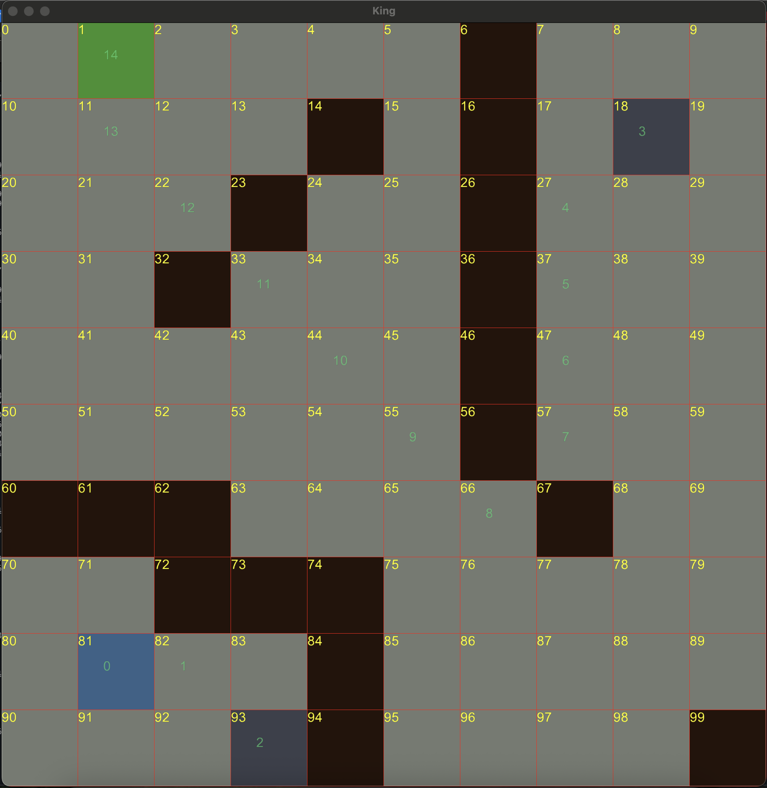

# Maze Solver
Simple ruby app that uses A* to solve a grid problem.

## Requirements
* Ruby 2.7.7
* Bundler 2.4.22

## Setup
1. `git clone git@github.com:vonum/maze-solver.git`
2. `bundle install`
3. `ruby game.rb N_ROWS N_COLS` -> `ruby game.rb 5 5`

## Types of Cells
Click `N` times on each cell to change it's behaviour.

1. Wall
2. Portal
3. Fire
4. Item
5. Start location
6. End location

## Movement
Scroll mouse to change movement type.

1. King
2. Bishop
3. Rook
4. Knight

## Commands
1. Esc -> exit
2. r -> reset grid
3. Space -> solve

